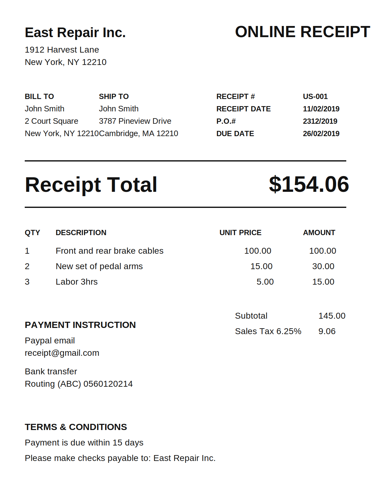

# boring-ai

Self-hosted AI receipt processing for freelancers.

`boring-ai` turns messy receipts into structured expenses you can review, fix,
save, search, edit, and export.

## Core workflow

```text
Upload -> OCR -> Extract -> Review -> Save -> Browse -> Export
```

## What it does

- Upload receipts as images or PDFs
- Extract raw text with Tesseract OCR
- Convert OCR text into structured fields with AI
- Keep the extracted fields editable before save
- Store expenses in SQLite
- Browse saved expenses in a workspace
- Search and filter by vendor, category, and date
- Export filtered expenses to CSV
- Delete bad records

## Why this exists

Managing receipts is boring.

Freelancers usually need something lighter than full accounting software, but
they still need a reliable flow for capturing expenses, checking AI output, and
exporting clean data later.

`boring-ai` is focused on that narrow workflow.

## Demo receipt

The app ships with a bundled demo receipt so a first-time user can try the full
flow without hunting for sample files.



- frontend demo asset: [`frontend/public/demo/east-repair-receipt.svg`](./frontend/public/demo/east-repair-receipt.svg)
- sample noisy OCR text: [`examples/east-repair-messy-ocr.txt`](./examples/east-repair-messy-ocr.txt)
- expected structured output: [`examples/east-repair-expected.json`](./examples/east-repair-expected.json)

If the demo flow works as expected, it should lead to:

```json
{
  "vendor": "East Repair Inc.",
  "amount": 154.06,
  "date": "2019-11-02",
  "category": "transport"
}
```

## Project status

This is an early but usable public release.

What works today:

- upload and preview
- OCR
- AI extraction
- editable review
- save to SQLite
- expense workspace
- CSV export
- delete action
- Render and Vercel deployment setup

What is intentionally not here yet:

- auth
- multi-user support
- bank imports
- complex dashboards
- background job systems

## Quick start

### 1. Install OCR tools

macOS:

```bash
brew install tesseract poppler
```

### 2. Start the backend

```bash
cd backend
python3 -m venv .venv
source .venv/bin/activate
pip install -r requirements.txt

export APP_ENV=development
export BACKEND_CORS_ORIGINS=http://localhost:3000,http://127.0.0.1:3000
export SQLITE_DATABASE_PATH=backend/data/boring-ai.db
export OPENAI_API_KEY=your_key_here
export OPENAI_MODEL=gpt-4o-mini
export OPENAI_API_BASE_URL=https://api.openai.com/v1
export OPENAI_TIMEOUT_SECONDS=30

uvicorn app.main:app --reload --port 8000
```

### 3. Start the frontend

Create `frontend/.env.local` with:

```bash
NEXT_PUBLIC_API_BASE_URL=http://127.0.0.1:8000
```

Then run:

```bash
cd frontend
npm install
npm run dev
```

Open [http://localhost:3000](http://localhost:3000).

If `OPENAI_API_KEY` is not set, upload and OCR still work, but AI extraction
will not.

## First run inside the app

1. Click `Try demo receipt`
2. Click `Store receipt locally`
3. Click `Extract text`
4. Click `Extract fields`
5. Review the draft
6. Click `Save expense`
7. Open the workspace and try CSV export

## Environment variables

Backend:

- `APP_ENV`
- `BACKEND_CORS_ORIGINS`
- `SQLITE_DATABASE_PATH`
- `OPENAI_API_KEY`
- `OPENAI_MODEL`
- `OPENAI_API_BASE_URL`
- `OPENAI_TIMEOUT_SECONDS`

Frontend:

- `NEXT_PUBLIC_API_BASE_URL`

Start with [`./.env.example`](./.env.example).

## Deploy with Render and Vercel

The current deployment split is:

- Render for the FastAPI backend
- Vercel for the Next.js frontend

Included files:

- [`render.yaml`](./render.yaml)
- [`backend/Dockerfile`](./backend/Dockerfile)

Why this split:

- the frontend is a normal Next.js app, which fits Vercel well
- the backend needs Tesseract, Poppler, SQLite, and persistent uploads, which
  makes Render a better fit here

Important deployment notes:

- Render needs a persistent disk for SQLite and uploaded files
- `BACKEND_CORS_ORIGINS` must include the Vercel frontend URL with `https://`
- `NEXT_PUBLIC_API_BASE_URL` must point at the Render backend URL
- AI extraction needs `OPENAI_API_KEY` on the backend

## API overview

System:

- `GET /health`

Uploads:

- `POST /api/uploads`
- `GET /api/uploads/{id}`
- `POST /api/uploads/{id}/ocr`
- `POST /api/uploads/{id}/extract`

Expenses:

- `POST /api/expenses`
- `GET /api/expenses`
- `GET /api/expenses/{id}`
- `PUT /api/expenses/{id}`
- `GET /api/expenses/export`
- `DELETE /api/expenses/{id}`

## Project structure

```text
boring-ai/
├── backend/
├── frontend/
├── examples/
├── .github/
├── .env.example
├── CONTRIBUTING.md
├── LICENSE
├── README.md
└── roadmap.md
```

## Privacy notes

- uploaded files stay on the local filesystem under `backend/uploads/files/`
- upload metadata stays under `backend/uploads/metadata/`
- saved expenses are stored in SQLite
- AI extraction currently uses the OpenAI API
- local model support can come later

## Roadmap

See [`roadmap.md`](./roadmap.md).

Near-term improvements:

- more polished app screenshots or GIFs
- more sample receipts in `examples/`
- better OCR trust messaging and quality hints
- more resilient extraction for difficult receipts

## Contributing

See [`CONTRIBUTING.md`](./CONTRIBUTING.md) for setup, workflow, and pull request
guidelines.

Good first contribution areas:

- UI polish
- clearer loading and empty states
- OCR edge-case handling
- extraction quality improvements
- README and docs polish
- better sample receipts and demo assets

## License

MIT. See [`LICENSE`](./LICENSE).
