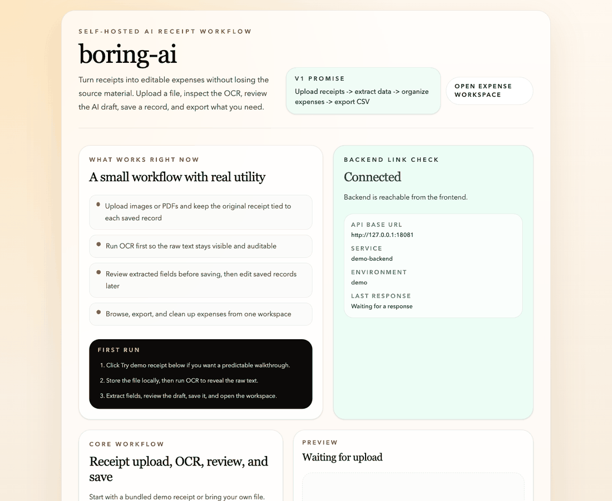
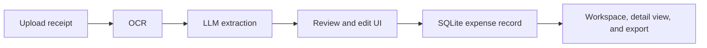

# boring-ai

Self-hosted AI receipt processing for freelancers.

`boring-ai` turns messy receipts into structured expenses you can review, fix,
save, search, edit, and export.

Upload receipts -> extract structured data -> review -> save.
No SaaS. No lock-in. Full control.

## Core workflow

```text
Upload -> OCR -> Extract -> Review -> Save -> Browse -> Export
```

## Product demo



The walkthrough above uses the bundled East Repair receipt and shows the full
first-run path:

1. Load the demo receipt
2. Store it locally
3. Run OCR
4. Extract editable fields
5. Save the expense
6. Open the workspace

## What it does

- Upload receipts as images or PDFs
- Classify uploaded files as receipts, invoices, or unknown documents
- Extract raw text with Tesseract OCR
- Convert OCR text into structured fields with AI
- Keep the extracted fields editable before save
- Show OCR and extraction confidence signals so users know when to trust the draft and when to review it carefully
- Show field-level confidence and extraction provenance for the core saved fields
- Store expenses in SQLite
- Browse saved expenses in a workspace
- Search and filter by vendor, OCR text, category, document type, duplicate status, and review status
- Surface likely duplicates before save and inside the workspace
- Sort the workspace by date, amount, or review priority
- Open saved expenses in a detail view and edit them later
- Export filtered expenses to CSV
- Delete bad records

## Why this exists

Managing receipts is boring.

Freelancers usually need something lighter than full accounting software, but
they still need a reliable flow for capturing expenses, checking AI output, and
exporting clean data later.

`boring-ai` is focused on that narrow workflow.

Most AI expense tools are expensive, closed, or not truly self-hosted.

`boring-ai` aims for something simpler:

- transparent
- local-first
- human-in-the-loop
- built for real bookkeeping handoff, not just a flashy demo

## Trust-first design

Instead of hiding uncertainty, `boring-ai` surfaces it:

- `High confidence` means the OCR or extraction looks healthy enough to be a strong save candidate
- `Medium confidence` means the draft is usable, but review is recommended
- `Low confidence` means the draft probably needs human correction before save

The goal is not to pretend the model is always right. The goal is to keep the
user in control.

## Demo receipt

The app ships with a bundled demo receipt so a first-time user can try the full
flow without hunting for sample files.


- frontend demo asset: [`frontend/public/demo/east-repair-receipt.svg`](./frontend/public/demo/east-repair-receipt.svg)
- sample noisy OCR text: [`examples/east-repair-messy-ocr.txt`](./examples/east-repair-messy-ocr.txt)
- expected structured output: [`examples/east-repair-expected.json`](./examples/east-repair-expected.json)

If the demo flow works as expected, it should lead to:

```json
{
  "vendor": "East Repair Inc.",
  "amount": 154.06,
  "date": "2019-11-02",
  "category": "transport"
}
```

## Project status

This is an early but usable public release.

What works today:

- upload and preview
- OCR
- AI extraction
- editable review
- save to SQLite
- expense workspace
- CSV export
- delete action
- review-priority workspace triage
- Render and Vercel deployment setup

## What we have built so far

The repo has moved past a basic OCR demo. On `main`, `boring-ai` now includes:

- local upload and receipt preview for images and PDFs
- OCR with Tesseract and PDF support
- OCR preprocessing with multiple image variants and normalized text cleanup
- document classification for receipts, invoices, and unknown files
- hybrid receipt extraction that combines heuristics with LLM parsing
- richer extracted receipt fields: subtotal, tax, receipt number, due date, payment method, and line items
- editable review before save, with OCR confidence and extraction confidence signals
- field-level confidence indicators for vendor, amount, date, and category
- extraction provenance showing where saved values came from
- field validation checks before save
- duplicate detection warnings before saving a new expense
- SQLite persistence for expense records
- expense detail and edit flow for saved records
- audit trail showing original extraction vs saved values
- saved-detail confidence and provenance visibility after save
- workspace search by vendor and OCR text
- category, date, document type, duplicate, and review-status filters
- sort controls for date, amount, and review priority
- workspace summary cards for review status, document type, duplicates, and reset-to-default
- active-view hints so the workspace always explains why a subset is showing
- CSV export for filtered expense views
- delete support for bad records
- correction learning for vendor normalization and category hints
- extraction evals for benchmark receipt cases
- demo-first onboarding, sample files, README demo GIF, and open-source community files

Recent advanced improvements on `main`:

- Phase 11-style trust work: field-level confidence, validation, and duplicate warnings
- Phase 12-style extraction work: hybrid extraction plus stronger total/date/tax fallbacks, richer receipt fields, provenance, and OCR preprocessing
- Phase 13-style reliability work: evals, correction learning, duplicate surfacing, workspace triage, and smarter workspace search and sorting

What is intentionally not here yet:

- auth
- multi-user support
- bank imports
- complex dashboards
- background job systems

## Tech stack

- Frontend: Next.js
- Backend: FastAPI
- OCR: Tesseract with PDF support through Poppler/pdf2image
- Extraction: LLM-based parsing with OpenAI-compatible APIs
- Database: SQLite
- Deployment: Vercel for the frontend, Render for the backend

## Architecture



## Workspace triage

The expense workspace now behaves like a review inbox, not just a table.

- review-priority sorting brings weak records to the top
- review-status filters separate low-confidence, medium-confidence, and strong records
- document-type filters separate receipts, invoices, and unknown files
- duplicate surfacing highlights likely duplicate groups directly in the list
- summary cards let users jump into review queues in one click
- active-view hints explain why the current subset is being shown

This makes cleanup, export review, and bookkeeping handoff much faster.

## Release readiness

Recent verification on the current codebase:

- `cd backend && ./.venv/bin/python -m compileall app`
- `cd frontend && npx next build --webpack`
- `cd backend && ./.venv/bin/python ../evals/run_receipt_extraction.py`
- mixed-record workspace QA covering:
  - review-priority sorting
  - review-status filters
  - document-type filters
  - duplicate-only view
  - filtered CSV export alignment

## Quick start

### 1. Install OCR tools

macOS:

```bash
brew install tesseract poppler
```

### 2. Start the backend

```bash
cd backend
python3 -m venv .venv
source .venv/bin/activate
pip install -r requirements.txt

export APP_ENV=development
export BACKEND_CORS_ORIGINS=http://localhost:3000,http://127.0.0.1:3000
export SQLITE_DATABASE_PATH=backend/data/boring-ai.db
export OPENAI_API_KEY=your_key_here
export OPENAI_MODEL=gpt-4o-mini
export OPENAI_API_BASE_URL=https://api.openai.com/v1
export OPENAI_TIMEOUT_SECONDS=30

uvicorn app.main:app --reload --port 8000
```

### 3. Start the frontend

Create `frontend/.env.local` with:

```bash
NEXT_PUBLIC_API_BASE_URL=http://127.0.0.1:8000
```

Then run:

```bash
cd frontend
npm install
npm run dev
```

Open [http://localhost:3000](http://localhost:3000).

If `OPENAI_API_KEY` is not set, upload and OCR still work, but AI extraction
will not.

## First run inside the app

1. Click `Try demo receipt`
2. Click `Store receipt locally`
3. Click `Extract text`
4. Click `Extract fields`
5. Review the draft
6. Click `Save expense`
7. Open the workspace and try CSV export

## Environment variables

Backend:

- `APP_ENV`
- `BACKEND_CORS_ORIGINS`
- `SQLITE_DATABASE_PATH`
- `OPENAI_API_KEY`
- `OPENAI_MODEL`
- `OPENAI_API_BASE_URL`
- `OPENAI_TIMEOUT_SECONDS`

Frontend:

- `NEXT_PUBLIC_API_BASE_URL`

Start with [`./.env.example`](./.env.example).

## Deploy with Render and Vercel

The current deployment split is:

- Render for the FastAPI backend
- Vercel for the Next.js frontend

Included files:

- [`render.yaml`](./render.yaml)
- [`backend/Dockerfile`](./backend/Dockerfile)

Why this split:

- the frontend is a normal Next.js app, which fits Vercel well
- the backend needs Tesseract, Poppler, SQLite, and persistent uploads, which
  makes Render a better fit here

Important deployment notes:

- Render needs a persistent disk for SQLite and uploaded files
- `BACKEND_CORS_ORIGINS` must include the Vercel frontend URL with `https://`
- `NEXT_PUBLIC_API_BASE_URL` must point at the Render backend URL
- AI extraction needs `OPENAI_API_KEY` on the backend

## API overview

System:

- `GET /health`

Uploads:

- `POST /api/uploads`
- `GET /api/uploads/{id}`
- `POST /api/uploads/{id}/ocr`
- `POST /api/uploads/{id}/extract`

Expenses:

- `POST /api/expenses`
- `GET /api/expenses`
- `GET /api/expenses/{id}`
- `PUT /api/expenses/{id}`
- `GET /api/expenses/export`
- `DELETE /api/expenses/{id}`

## Project structure

```text
boring-ai/
├── backend/
├── frontend/
├── examples/
├── .github/
├── .env.example
├── CONTRIBUTING.md
├── LICENSE
├── README.md
└── roadmap.md
```

## Privacy notes

- uploaded files stay on the local filesystem under `backend/uploads/files/`
- upload metadata stays under `backend/uploads/metadata/`
- saved expenses are stored in SQLite
- AI extraction currently uses the OpenAI API
- local model support can come later

## Roadmap

See [`roadmap.md`](./roadmap.md).

Near-term improvements:

- more polished app screenshots or GIFs
- more sample receipts in `examples/`
- better OCR trust messaging and quality hints
- more resilient extraction for difficult receipts

## Contributing

See [`CONTRIBUTING.md`](./CONTRIBUTING.md) for setup, workflow, and pull request
guidelines.

Good first contribution areas:

- UI polish
- clearer loading and empty states
- OCR edge-case handling
- extraction quality improvements
- README and docs polish
- better sample receipts and demo assets

## License

MIT. See [`LICENSE`](./LICENSE).
